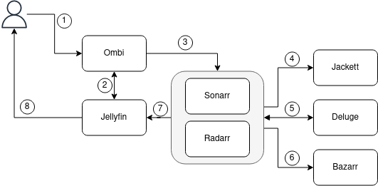
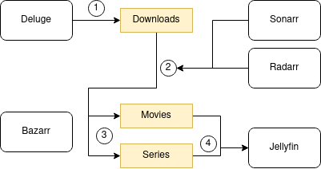

/*
Title: Mediaserver
Description: Home
*/

This is the knowledgebase to configure your own mediaserver.

The current scripts and service are currently running in a Raspberry Pi 4, but everything should work on any other hardware with container capabilities.

## Overview
The Mediaserver project started with the objective of creating a self-hosted media solution with automated downloads for movies and series via torrent. But as it evolved, the scope became bigger and bigger, and now it is running all of my self hosted services.


## Table of contents
- [Hardware Specifications](#hardware-specifications)
- [Integration](#integration)
    - [Services](#services)
    - [Volumes](#volumes)

### Hardware Specifications

The server itself has nothing special regarding hardware:

- RaspberryPi 4
- 7TB external Harddrive
    - mounted in '/mnt/storage'

## Integration

### Services

This is diagram shows how the services interact with themselves since a new media is *requested* until it become available to be *reproduced*:



1. User create a new *request* via **requests.DOMAIN**;
2. **Ombi** is integrated with **Jellyfin**, so there will be no duplicates;
3. Depending on which kind of media is requested, it will notify **Sonarr** or **Radarr**;
4. **Sonarr/Radarr** will fetch download options from the **Jackett**
5. If there is a download to be made, **Sonar/Radarr** add it to **Deluge** and tracks its progress;
6. As soon as the download is complete, **Bazarr** is notified and start looking for subtitles;
7. **Jellyfin** is then notified and scans the media folder;
8. The **User** is now able to reproduce the requested media;

### Volumes

Apart from the diagram above, we have some interaction at a **volume** level, this is why some services have some *volume mapping* in common. The diagram below illustrates that:



1. A new file is donwloaded into **Downloads** folder;
2. **Sonarr/Radarr** creates a *hard link* of the media files to **Movies** or **Series**; (*)
3. **Bazarr** gets notified a new file arrived, and download subtitles into this folders;
4. **Jellyfin** then serves the downloaded media from the latter;

The *hard link* strategy, allows us to keep the **same file** in 2+ different folders. This way we can keep the folder structure to **Deluge** be able to seed those files, and we can organize our library to **Jellyfin** without duplicating any files.

At **downloads** folder you have something like this:

```
downloads
├── Studio.666.2022.PROPER.1080p.WEBRip.x264-RARBG
:   :
├── Westworld.S04E06.720p.WEB.h264-KOGi[TGx]
└── Westworld.S04E07.720p.WEB.H264-CAKES[TGx]
```

And at the **media** folder you have:

```
movies
:
├── Studio 666 (2022)
│   ├── Studio 666 (2022).en.srt
│   ├── Studio 666 (2022).mp4
│   └── Studio 666 (2022).pt-BR.srt
:

series
:
├── Westworld (2016)
:   :
│   └── Season 4
│       ├── metadata
:       :
│       ├── Westworld (2016) S04E06 - Fidelity.mkv
│       ├── Westworld (2016) S04E06 - Fidelity.pt-BR.srt
│       ├── Westworld (2016) S04E07 - Metanoia.mkv
│       └── Westworld (2016) S04E07 - Metanoia.pt-BR.srt
:
```

> **Note:** Once the torrent stops seeding the file will be copied, so always check your available storage and clean it up periodically. 
